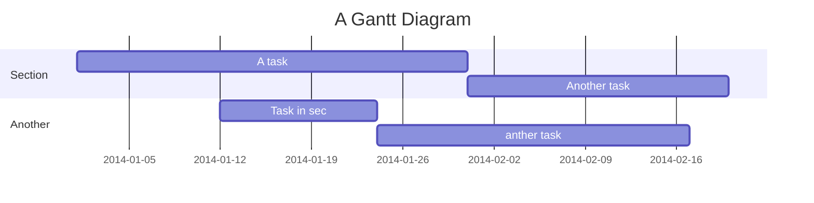

# 這是部落格的第一個文章
##### tag: `blog-test`

## 標題啦

### 喔耶它會動嗎
欸幹，部落格欸，可以養嗎

**我會變粗體嗎**
~~我刪除線啦哈~~
```cpp
#include <iostream>

using namespace std;

int main(){
    cout << "hello world" << endl; // 你好啊世界
    return 0;
}
```
> 欸幹 部落格欸 可以養嗎



:::danger
喔不 :fire:
:::

<div class="alert alert-info">
    hi
</div>