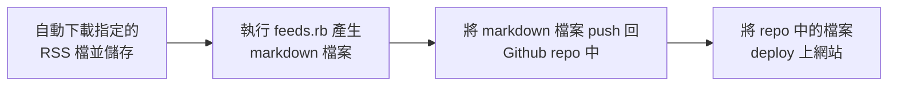
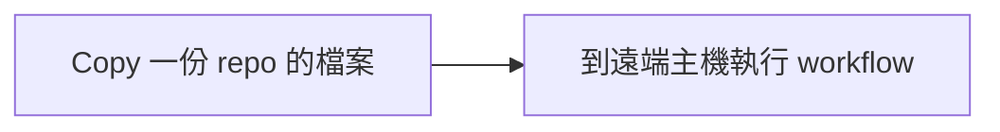

在上篇 [將其他 blog 的文章連結到 Jeykyll blog](/posts/link_to_other_blog) 使用了手動的方式下載 RSS 檔案，並在本地端執行完 `feeds.rb`{: .filepath} 後再 push 到 Github 上。 <br>
文末也提到我希望全自動執行這個動作，時隔半年，在各方取捨之下終於做出了一個能符合我八成需求的 workflow 了。 <br>

> 由於我本人也不太會 Github Action 的撰寫，主要是用拼湊的完成這次的 code ，所以這裡不會深入講解 workflow 中的語法。 <br>
> 如有錯誤或不精確的部分，歡迎到文章最下方留言指教。
{: .prompt-danger}

## 流程

我們要自動執行的流程如下：



<br>

我將依照這個順序分享我是怎麼利用 Github Action 達成目標。 <br>
完整的 code 我會附在[最下面](/posts/automatic_link_to_other_blog/#完整程式碼)

## 一、自動下載指定的 RSS 檔並儲存

這裡我找到了一個 action 可以幫忙下載網路上的檔案進 Github repo 中： [wow-actions/download-upload](https://github.com/wow-actions/download-upload)。 <br>
這樣使用它：
- 在 `url` 中填上要下載的檔案網址。 <br>
- 在 `dir` 中寫上檔案下載後的儲存路徑。 <br>
- 在 `filename` 中填寫下載下來的檔案名稱。 <br>

```yml
- uses: wow-actions/download-upload@v1
    with:
        GITHUB_TOKEN: ${{ secrets.GITHUB_TOKEN }}
        url: "https://blog.ryankert.cc/atom.xml"
        dir: assets/friends_file/
        filename: RyanKert.xml
```

## 二、執行 feeds.rb 產生 Markdown 檔案

這一步驟會讓 `feeds.rb`{: .filepath} 來解析 RSS ，產生相應的 markdown 以供 [friends 頁面](/friends) 使用。 <br>
關於 `feeds.rb`{: .filepath} 可以參照 [上一篇](/posts/link_to_other_blog/#步驟1-下載-jekyll-feed-importer) 。

### Github Action 運作機制帶來的問題

這裡出現了一個小問題， Github Action 的執行大致上是：



簡單來說就是我們的遠端主機並沒有在上一步驟下載的新檔案，它被存在 Github 的 repo 中。 <br>
所以這裡我使用了另一個 job: `generate-md-file-for-rss`{: .filepath} ，希望這個步驟可以在上一步驟下載完後重新 copy 一份 repo 中的 code。 <br>
同時**必須新增 `needs` 變數**來讓這個 job 接續在上一個 job: `download-feed-file-automatically`{: .filepath} 之後執行。 <br>
否則它們預設是平行執行的，新的 job 會比舊的 job 還要早被執行。 <br>
> 註：這裡我其實不太確定原理是不是真的這樣運作，反正分開跑是 ok 的。

```yml
generate-md-file-for-rss:
    needs: download-feed-file-automatically
```

### 執行 feeds.rb

再來就能安心執行 `feeds.rb`{: .filepath} 了！
在 Github Action 中是可以直接使用 `run: <command>` 來直接執行指令的，但這裡因為要執行 Ruby 檔案，必須要**先進行設定**。 <br>
Ruby 官方有提供專門的設定： [ruby/setup-ruby](https://github.com/ruby/setup-ruby) ， 我們可以很簡單的使用它。 <br>
設定完成後就可以直接執行 ruby 檔了。 <br>

```yml
- name: setup ruby
    uses: ruby/setup-ruby@v1
    with:
        ruby-version: 3.1 # Not needed with a .ruby-version file
- name: install bundle
    run: bundle install
- name: run feeds.rb
    run: ruby feeds.rb
```

## 三、將 Markdown 檔案 Push 回 Github Repo 中

如前面所說，我們是在遠端主機操作一份 copy 下來的 repo ，所以我們對他進行任何變更都不會變動到還在 Github 上的 repo 。 <br> 
就好像我們從 Github 上 pull 下檔案並修改後，修改完的檔案依舊存在 local 端，不會動到 Github 上的檔案。 <br>
而要讓他進行變動當然就是使用 **push** 功能。 <br>
這裡搭配 [ad-m/github-push-action](https://github.com/ad-m/github-push-action) 來實現這個功能。 <br>
和平常使用 git 一樣，必須先 commit 才能 push ， 在 `github_token` 中特地使用自己的 personal token 是為了下一步做準備：

```yml
- name: Commit files
    run: |
        git config --local user.email "41898282+github-actions[bot]@users.noreply.github.com"
        git config --local user.name "github-actions[bot]"
        git add ./_friends_link
        git commit -a -m "Automatic add file from workflow"
    - name: Push changes
    uses: ad-m/github-push-action@master
    with:
        github_token: ${{ secrets.PERSONAL_TOKEN }}
        branch: ${{ github.ref }}
        force: true
```

## 四、將 Repo 中的檔案 Deploy 上網站

更新完檔案後我們就可以直接執行原本 blog 的 deploy 了，我的主題 [Chirpy](https://github.com/cotes2020/jekyll-theme-chirpy) 有幫我寫好 deploy 的 Action，會在 push 時自動執行。 <br>
然而 [Github Action 官方文件](https://docs.github.com/en/actions/using-workflows/triggering-a-workflow) 中提到由 repo 的 `GITHUB_TOKEN` 來觸發的 push 不會被當作一般 push 看待，所以原本的 deploy 會偵測不到在上一步驟執行的 push 。 <br>
當然官方也給了解決方法，就是讓 Github 以為是人類 push 就好了。 <br>

###  使用 Personal Token

personal token 是一個替代帳密的方式，利用這個 token 我們可以以自己的身份（以我為例就是 titaliu1224）來操作 Github 上的功能。 <br>
利用 [官方文件：Creating a personal access token](https://docs.github.com/en/authentication/keeping-your-account-and-data-secure/creating-a-personal-access-token) 產生 token 後，再參照 [官方文件：Encrypted secrets](https://docs.github.com/en/actions/security-guides/encrypted-secrets#creating-encrypted-secrets-for-a-repository) 將 token 新增至 repo 的 secret 中，我將它命名為 `PERSONAL_TOKEN` 。 <br>
關於 token 在 github-push-action 中所使用的權限可以參照 [他們的 issue](https://github.com/ad-m/github-push-action/issues/111) ，我們可以和他們選擇相同的權限。 <br>
這樣就能使用 personal token 來誤導（？） Github Action 了！ <br>
在 workflow 幫我們 push 完，原本的 deploy workflow 就會跟著自動執行，完成我們的朋友貼文更新。

### Commit 產生的錯誤

若目前沒有任何朋友發新文章， `feeds.rb`{: .filepath} 就不會產生新的 markdown ，從而導致 `_friends_link`{: .filepath} 中沒有新增檔案，這將會導致 commit 出現類似的錯誤訊息：
```
Your branch is up to date with 'origin/main'.
Error: Process completed with exit code 1.
```
{: file="commit error"}

我認為這個 bug 暫時不需要修改，在這個 bug 出現時代表不需要 push ，而他也不會 push ，這樣就不會觸發到網站 deploy 的 workflow ，導致不必要的執行。 <br>

## 結語

如此便完成自動下載 feed 檔，並將其 deploy 到網站上啦！ <br>
過了半年終於把這個功能給用好，往後一個月就來觀察一下他有沒有好好運作啦～ <br>
如果對我的文章感興趣歡迎訂閱我的 RSS ，或是點擊左下角的 <i class="fas fa-rss"></i> 圖標來查看。

## 完整程式碼

```yml
name: 'Automatic build for downloading feed'
on:
  schedule: # Run workflow automatically
    - cron: '0 * * * *' # Runs every hour, on the hour
  workflow_dispatch: # Run workflow manually (without waiting for the cron to be called), through the Github Actions Workflow page directly

jobs:   
  download-feed-file-automatically:
    name: Update this feed files for friends
    runs-on: ubuntu-latest
    steps:
      - uses: actions/checkout@v3
      - uses: wow-actions/download-upload@v1
        with:
          GITHUB_TOKEN: ${{ secrets.GITHUB_TOKEN }}
          url: "https://tigercosmos.xyz/atom.xml"
          dir: assets/friends_file/
          filename: tigercosmos.xml
          
      - uses: wow-actions/download-upload@v1
        with:
          GITHUB_TOKEN: ${{ secrets.GITHUB_TOKEN }}
          url: "https://blog.ryankert.cc/atom.xml"
          dir: assets/friends_file/
          filename: RyanKert.xml
          
  generate-md-file-for-rss:
    needs: download-feed-file-automatically
    name: transfer rss to markdown
    runs-on: ubuntu-latest
    steps:
      - uses: actions/checkout@v3
        with:
          token: ${{ secrets.PERSONAL_TOKEN }}
      - name: print directory
        run: ls -al
      - name: setup ruby
        uses: ruby/setup-ruby@v1
        with:
          ruby-version: 3.1 # Not needed with a .ruby-version file
      - name: install bundle
        run: bundle install
      - name: run feeds.rb
        run: ruby feeds.rb
        
      - name: Commit files
        run: |
          git config --local user.email "41898282+github-actions[bot]@users.noreply.github.com"
          git config --local user.name "github-actions[bot]"
          git add ./_friends_link
          git commit -a -m "Automatic add file from workflow"
      - name: Push changes
        uses: ad-m/github-push-action@master
        with:
          github_token: ${{ secrets.PERSONAL_TOKEN }}
          branch: ${{ github.ref }}
          force: true
        
        
```
