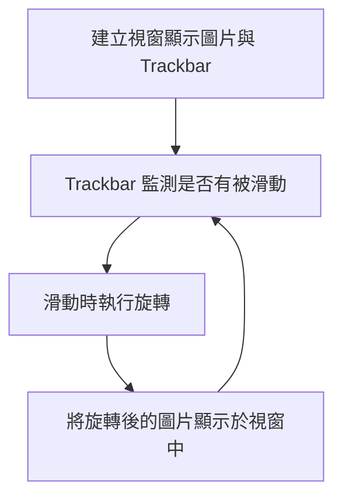
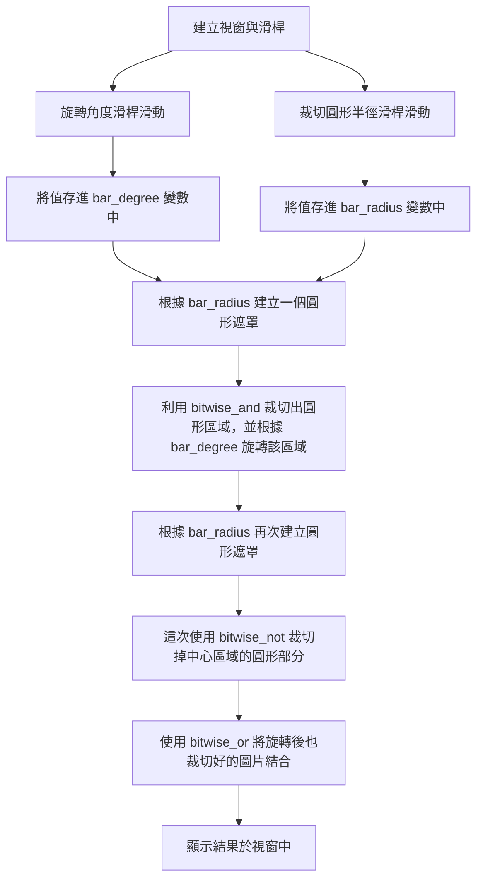

本系列將紀錄影像處理小白從 0 開始學習 Python x OpenCV 的過程。  
透過選修課一次次的作業把影像處理的基礎知識建立起來。  

這次的作業是入場門票般的練手程度，是簡單的裁剪圖片和旋轉圖片。  
若好奇其他進階一點的作業歡迎查看 [影像處理分類](/categories/python-影像處理/)  

## 功課要求
撰寫一個程式將一張圖像的 <br>
(a)整張圖像 <br>
(b)中心內切圓區域 <br>
旋轉一個角度（逆時針旋轉 0 度至 359 度）：利用一個滑動條(trackbar)控制旋轉角度。

## 成果
{: w="500", h="500"}
_透過滑動滑桿調整整張圖片的旋轉角度_

{: w="500", h="500"}
_透過滑桿調整內切圓半徑與旋轉角度_

## 開發環境

| OS         | Editor             | Language      | OpenCV       |
|------------|--------------------|---------------|--------------|
| Windows 10 | Visual Studio Code | Python 3.9.16 | OpenCV 4.5.4 |

## 做法

> 本次程式碼： <br>
> [旋轉整張圖像](https://github.com/titaliu1224/Image-Processing/blob/main/assignment1/rotate.ipynb) <br>
> [旋轉中心圓形](https://github.com/titaliu1224/Image-Processing/blob/main/assignment1/crop-and-rotate.ipynb)

### 旋轉整張圖像

這個的想法非常簡單，取得特定圖像的旋轉矩陣後把整張圖片乘上旋轉矩陣後就好。



#### 旋轉圖像

所以我寫了一個 Function 好讓 Trackbar 可以重複執行旋轉的動作：
```py
def rotate_img(val):
    global origin_img, result_img
    (h, w, d) = origin_img.shape # 讀取圖片大小
    center = (w // 2, h // 2) # 找到圖片中心
    
    # 取得旋轉矩陣
    M = cv2.getRotationMatrix2D(center, val, 1.0)
    print(val)
    
    result_img = cv2.warpAffine(origin_img, M, (w, h))
    cv2.imshow("Rotate Image", result_img)
```

#### 建立 Trackbar

至於 Trackbar 的建立也非常簡單： <br>
利用 `imshow` 顯示目前的圖片，再使用 `createTrackbar` 在該視窗建立滑動條。 <br>
`createTrackbar` 的參數分別是 `滑桿名稱` , `視窗名稱` , `最小值` , `最大值` , `滑動時要執行的函式`

```py
cv2.imshow("Rotate Image", result_img)
cv2.createTrackbar("degree", "Rotate Image", 0, 359, rotate_img)
```

如此一來就建立了一個這樣的視窗：

{: w="500", h="500"}
_利用 imshow 和 createTrackbar 產生的 GUI 視窗_

### 旋轉中心圓形區域

切圓形實在不是那麼直觀，透過建立一個 Mask 作為遮罩，來協助我們裁切特定圖片區域。 <br>
流程圖如下：



#### 旋轉中心圓區域

首先必須先找到中心圓區域做旋轉： <br>
1. 利用 `np.zeros_like(origin_img)` 製作一個和原圖片相同尺寸的全黑圖片。（其中 `np` 為 `numpy`） <br>
2. 利用 `cv2.circle(img, center, radius, color, thickness)` 在剛剛的全黑畫布上畫一個實心白色圓形，生成一個圓形遮罩
  - `img` : 要用來畫圓的圖片
  - `center` : 圓心座標 (X, Y)
  - `radius` : 圓的半徑
  - `color` : 圓的顏色 (B, G, R)
  - `thickness` : 圓的框線粗細，以 px 為單位，設為 -1 會填滿整個圓
{: w="500", h="500"}
3. 把圓形遮罩拿來和原圖 `cv2.bitwise_and(src1, src2[, dst[, mask]])` 後，由於剛剛的圓形遮罩只有中心圓形部分有值（白色），所以進行 AND 後能得到原圖的中心圓形部分。
   - `src1` , `src2` : input
   - `dst` : output
   - `mask` : 指定要使用 `src1` 和 `src2` 的哪些位置來做運算，是一個 8-bit 單通道 array
   - 關於參數中的 `[]` ，那代表參數可以自行選擇要不要填，並非必要參數，可以參考 [這篇文章](https://blog.csdn.net/Dontla/article/details/101722486)  
{: w="500", h="500"}
4. 再來就能把這個圓形圖片丟到剛剛提到的旋轉函式裡了！

```py
def crop_circle(radius):
    global origin_img
    (h, w, d) = origin_img.shape # 讀取圖片大小
    center = (w // 2, h // 2)

    # 產生 mask
    mask = np.zeros_like(origin_img)
    mask = cv2.circle(mask, center, radius, (255,255,255), -1)

    # 取得圓形圖片
    crop = cv2.bitwise_and(origin_img, mask)

    return crop
```

#### 結合旋轉後的圓到原圖上

再來就是將旋轉完的圓形貼回原圖，這裡一樣要用到圓形遮罩來實現。
1. 像剛剛一樣畫一個黑底的白色圓形圖片
2. 使用 `cv2.bitwise_not(src[, dst[, mask]])` 將整個圖片的黑白翻轉，這樣就得到中心為黑色但四周為白色的遮罩。<br>
  {: w="500", h="500"}
3. 使用 `cv2.bitwise_and(src1, src2[, dst[, mask]])` 擷取圖片外圍，並利用 `cv2.bitwise_or(src1, src2[, dst[, mask]])` 結合兩張圖片，產生最終結果。
  

```py
def combine_img(center_img, radius):
    global origin_img
    (h, w, d) = origin_img.shape # 讀取圖片大小
    center = (w // 2, h // 2)
    
    # 產生 mask
    mask = np.zeros_like(origin_img)
    mask = cv2.circle(mask, center, radius, (255,255,255), -1)
    mask = cv2.bitwise_not(mask)

    # 取得圓形圖片 
    crop = cv2.bitwise_and(origin_img, mask)

    # 結合兩張圖片
    combined_img = cv2.bitwise_or(center_img, crop)

    return combined_img
```

## 總結

本篇利用 OpenCV 進行簡單的圖片旋轉與裁切，作為 OpenCV 和影像處理入門是非常友善的！ <br>
推薦想接觸影像處理領域的人嘗試。

## 參考資料
- [howarder3/ironman2020_OpenCV_photoshop](https://reurl.cc/9VvDOj)
- [加入滑桿 ( Trackbar )](https://steam.oxxostudio.tw/category/python/ai/opencv-trackbar.html)
- [How to use OpenCV to crop circular image?](https://stackoverflow.com/questions/61516526/how-to-use-opencv-to-crop-circular-image)

