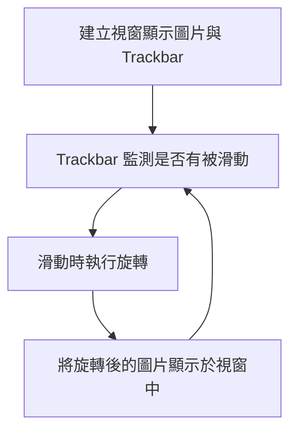
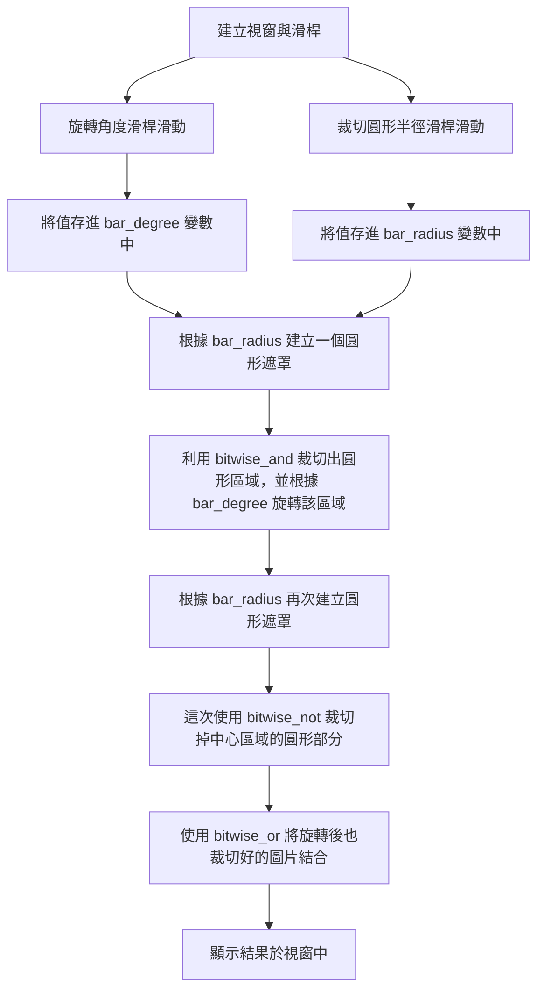

這是學校選修課的功課紀錄，同步發布於 [該課程 Blogger]()

## 功課要求
撰寫一個程式將一張圖像的 <br>
(a)整張圖像 <br>
(b)中心內切圓區域 <br>
旋轉一個角度（逆時針旋轉 0 度至 359 度）：利用一個滑動條(trackbar)控制旋轉角度。

## 成果

_透過滑動滑桿調整整張圖片的旋轉角度_


_透過滑桿調整內切圓半徑與旋轉角度_

## 做法

> 本次程式碼： <br>
> [旋轉整張圖像](https://github.com/titaliu1224/Image-Processing/blob/main/assignment1/rotate.ipynb) <br>
> [旋轉中心圓形](https://github.com/titaliu1224/Image-Processing/blob/main/assignment1/crop-and-rotate.ipynb)

### 旋轉整張圖像

這個的想法非常簡單，取得特定圖像的旋轉矩陣後把整張圖片乘上旋轉矩陣後就好。



所以我寫了一個 Function 好讓 Trackbar 可以重複執行旋轉的動作：
```py
def rotate_img(val):
    global origin_img, result_img
    (h, w, d) = origin_img.shape # 讀取圖片大小
    center = (w // 2, h // 2) # 找到圖片中心
    
    # 取得旋轉矩陣
    M = cv2.getRotationMatrix2D(center, val, 1.0)
    print(val)
    
    result_img = cv2.warpAffine(origin_img, M, (w, h))
    cv2.imshow("Rotate Image", result_img)
```

至於 Trackbar 的建立也非常簡單： <br>
利用 `imshow` 顯示目前的圖片，再使用 `createTrackbar` 在該視窗建立滑動條。 <br>
`createTrackbar` 的參數分別是 `滑桿名稱` , `視窗名稱` , `最小值` , `最大值` , `滑動時要執行的函式`

```py
cv2.imshow("Rotate Image", result_img)
cv2.createTrackbar("degree", "Rotate Image", 0, 359, rotate_img)
```

如此一來就建立了一個這樣的視窗：

_利用 imshow 和 createTrackbar 產生的 GUI 視窗_

### 旋轉中心圓形區域

切圓形實在不是那麼直觀，透過建立一個 Mask 作為遮罩，來協助我們裁切特定圖片區域。 <br>
流程圖如下：



首先必須先找到中心圓區域做旋轉： <br>
1. 利用 `np.zeros_like(origin_img)` 製作一個和原圖片相同尺寸的全黑圖片。（其中 `np` 為 `numpy`） <br>
2. 利用 `cv2.circle(img, center, radius, color, thickness)` 在剛剛的全黑畫布上畫一個實心白色圓形
  - `img` : 要用來畫圓的圖片
  - `center` : 圓心座標 (X, Y)
  - `radius` : 圓的半徑
  - `color` : 圓的顏色 (B, G, R)
  - `thickness` : 圓的框線粗細，以 px 為單位，設為 -1 會填滿整個圓


```py
def crop_circle(radius):
    global origin_img
    (h, w, d) = origin_img.shape # 讀取圖片大小
    center = (w // 2, h // 2)

    # 產生 mask
    mask = np.zeros_like(origin_img)
    mask = cv2.circle(mask, center, radius, (255,255,255), -1)
    print("mask: ")
    show_img(mask)

    # 取得圓形圖片
    crop = cv2.bitwise_and(origin_img, mask)

    return crop
```

