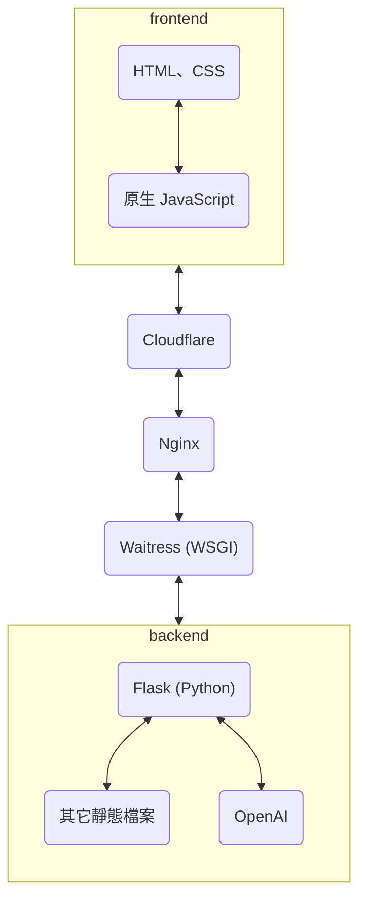

原標題為：半個月零基礎架設前後端分離網站  
這是關於一群小白第一次架設前後端分離網頁就算是圓滿成功的故事，這是一個在聖誕節期間，開放給全校同學遊玩的網頁，透過虛擬的網頁遊戲，找到實際上藏在校園內的糖果。  
本文將會記錄我們是如何構想這個專案，還有一些劇情上的細節、開會與實作的方式，比較偏向於開發時的流程和故事，關於技術上的硬細節請參照下篇：[《元得要命小鎮的聖誕危機》之誕生日誌（下）](/posts/christmas_project_tech/)。  
有點冗長的流水帳，電腦版可以利用右方的 ToC 進行跳轉。  

{: h="500"}
_網站首頁_

## 專案構想

這是一個令人肝痛的故事......  

### 1/ 小隊組成

當時約十月底時，我們想要做個聖誕節的企劃，建一個網頁讓全校的同學可以一起參與。  
決定好了就組織了一個四人小團隊，準備開工。  
小隊內的能力值大約是：沒有人知道前後端分離的運作模式，全部人都只有稍微碰過或是根本沒碰過（這我）。  
奈何十一月整個月都為了期中忙得要命，所以遲遲沒有動作，直到十一月底時才發現慘了。  

### 2/ 啊啊啊要來不及了

於是在 11/30 時召開了第一場會議，從這天開始，我們每晚 11 點就會在 Discord 上相聚，直到 12/17 正式進入宣傳階段才結束。  
共計 18 天的時間，半個月又平安的過去了，感謝死線戰士們的努力。  
（對的，晚上 11 點才開始開會，因為白天各自要上班上課、 coding ，要到晚上才有時間）  
（不過事實證明，晚上 11 點絕對不是一個適合開會的時間）  

12/1 決定好故事走向之後，一切才正式開始。  

### 3/ 網頁功能與故事

於是我們決定好，從 12/18 （一）到 12/25 （一），共計八天的時間，會在元智八個館內藏好糖果，玩家必須和代表該館的 NPC 進行對話（NPC 由 GPT-3.5 扮演），找到藏在館內的糖果，並推進劇情。  
每天的糖果位置都不一樣，隔日就會收走，所以要有完整的遊玩體驗都是當日限定的！  

故事的劇情發生在一個純樸的「元得要命小鎮」，由於瘋狂科學家杜芬舒斯的狗勾去世了，他致力於研發復活狗勾的機器，卻一直失敗導致爆炸，炸壞了小鎮上的設施讓居民很困擾。  
玩家扮演的冒險者為了幫助小鎮，四處收集材料並拜託各個領域的專家幫忙復活狗勾，讓小鎮恢復以前的和平。  
我們根據各館的特性創造了 8 個角色，以下是依照劇情順序排列的對照表：

| 館別 | 系別／特性       | 角色名稱          |
|------|------------------|------------------|
| 八館 | 社辦、課外活動   | 社交女王 糖糖     |
| 三館 | 機械、藝設、木工 | 矮人礦工 富帥．高 |
| 六館 | 管院、企業與貿易 | 流浪商人 安東尼奧 |
| 二館 | 化材、做實驗     | 巫師 艾莉絲       |
| 一館 | 資訊學院、寫程式 | 符文法師 哈羅沃德 |
| 七館 | 電通、電子裝置   | 科學家 杜芬舒斯   |
| 五館 | 語文、人社       | 吟遊詩人 哈雷嚕喵 |

至於各個角色的職業、名稱和該館的系有什麼聯想就交給各位發揮想像力了~  
角色的個性、名稱有時候只是我們覺得有趣就加上去了，可能和該館的系關聯不大。  

所以網頁主要的功能有：
1. 首頁
2. 播放劇情的文字與圖片
3. 玩家輸入文字並取得 ChatGPT 的回覆

{:w="231" h="500"}
_每日遊戲開始時的前言_

## 專案開發

決定好劇情大綱後，當然就是用最快的速度進入製作階段！

### 1/ 完善劇情

為了避免故事前後難以連貫，兩人一組進行前半／後半劇情的詳細內容發想。  
我們把每個館要收集的物品、糖果藏的位置透過每一次的開會慢慢討論起來。  
這時預定好要 12/11 開始進行一週的宣傳與測試。  
然而我們約 12/5 才定好全部的劇情。  

劇情的文字使用 csv 檔案進行儲存，技術細節可以參照[下篇](/posts/christmas_project_tech/#後端的運作)。

### 2/ 前後端各自開發

再來兩兩一組，分成了前端與後端。  
後端處理好讀取 csv 、串接 GPT 的部分（包含角色的 prompt）。  
前端處理文字顯示動畫、 UI 介面、角色圖背景圖物品圖等。  

### 3/ 伺服器選用 & 網頁架構

做為一個非靜態的網頁，一個可以全天為我們工作的伺服器是極其重要的角色。  
於是我們把腦筋動到實驗室內我常用的那台桌機。  
整體網頁的架構如下：

關於技術細節同樣可以參照[下篇](/posts/christmas_project_tech/)！

### 4/ 距離上線測試 -3 天

在我們瘋狂開會和使用 git 進行協作之下（git 小白們在這次的合作之下終於成為了 git 小能手），終於有正式可以運行的版本放到伺服器（實驗室桌機）上了～  
（撒花）(ﾉ◕ヮ◕)ﾉ*:･ﾟ✧

還記得我說了 12/11 要進入測試階段嗎？  
當我們終於把 code 、 server 、 domain 差不多弄好的時候，時間已經來到 12/14。  
Discord 頻道上的倒數也從 3、2、1 進入了負數。  
這時才終於可以在實體的手機 browser 上看到成品的樣子，然而還有很多跑版、 UI/UX 的問題等著處理。  

### 5/ 來不及了，在線上測試啦

處理完大部分的手機問題後，因為 Nginx 的部分一直難以搞定，我們一路到了 16 號晚上才終於脫離 development 模式，成為一個成熟的 web 產品（？）  
根據 GPT 所述，沒有 Nginx 的話多人直接連線到 dev server 會造成爛效能。  
於是 17 號，也就是遊戲正式開始的前一天，發佈了熱騰騰的，Dcard 宣傳文，代表著正式上線。  
（宣傳文雖然滿滿的 GPT 味，但還是修改討論了好久嗚嗚）   
（我有點 bug，沒辦法放狄卡的超連結，可以去元智校版搜尋「發聖誕糖果囉」）  

{: w="500"}
_12/13 時的 DC 頻道_

## 正式上線

真正上線後，人數一多，問題才漸漸浮現。 

### 1/ 玩家不理解遊戲內容

可能是宣傳文寫得不夠清楚的問題，玩家們一進來宣傳頁面就急著「誘導」 NPC 說出糖果的位置，不過宣傳用的社交女王糖糖並沒有被餵任何關於糖果位置的資訊，大家應該是得到了很多錯誤的答案。  
看見了很多我們測試時沒有想到的問題和對話方式，讓我（處理 NPC prompt 的人）突然意識到需要大修每一天的 prompt。  

這時發現我根本沒有好好的儲存 log ，只能從之前開發留下來的殘骸（為了測試而 print 出來的東西）看見大家傳過來的 request 內容。  
（對，一開始甚至看不到後端回覆的內容）  

### 2/ 重新整理問題

重新整理時可能會造成玩家跳到下一句台詞（就可以不用輸入答案直接跳過和 NPC 的對話），或是進入沒有圖片沒有台詞的空白頁面。  
這是因為重新整理後會重新送出一個 request 給後端，要求後端再給下一句台詞，細節我也很難描述，總之是因為重新要台詞的問題。  
所以我們透過 cookie 儲存玩家的遊玩進度，讓大家可以重新整理而不會有一些令人困惑的情形發生。  

### 3/ 每日維護時間

遊戲開放的時間是 10:00 ~ 22:00 ，剩餘時間讓我們可以準備糖果並且更新下一日的東西。  
原本是想說每天早上十點前爬起來啟動 server ，其餘時間我們測試完就關閉。  
但是這樣實在是太麻煩了！  
所以在後端寫了如果時間不落在開放時間，就要被 redirect 到維護頁面。  

不過沒辦法阻擋透過直接輸入網址進入遊戲的人，因為這個方法是我們測試用的路徑 :(  
原本是想說要不要再開一個測試用的 server ，但真的太麻煩了。  

### 4/ GPT API 要錢嗚嗚嗚

原本我們預計大概一天 20 個人會玩，一天也就送個 200 個 request 差不多，糖果準備個 40 顆也足夠。  
結果第一天我們就收到了 2000 個 request，糖果也在下午被拿光。  
往後幾日大家拿糖果跟送 request 的速度也是越來越快、越來越熟練。  

所以，使用 OpenAI 的 API 的我們， credit 的消耗速度來到了前所未有的快。  
我們為了使用新用戶的免費額度，額外開了一個新帳號。  
殊不知還沒儲值的用戶被歸類於 tier 0 ，每分鐘只能送 3 個 request，這個數量對於我們的網站遠遠不夠。  
遊戲進行的第四天早上一起床，就看見伺服器出現從未看過的 bug，緊急儲值重開伺服才解決。  
當天的網頁對話死機了 30 分鐘 :(  

{:w="231" h="500"}
_角色富帥．高吼，素一個縮話很有特色的人_

## 圓滿成功

好啦，總體來說算是圓滿成功。  

### 1/ 這個 project 就是一連串的意外

從一開始策畫完全沒有想到會是半個月要肝出來，到測試前沒想到必須要直接線上測試，再來是沒想到遊玩人數真的超多。  
很多我們沒有考慮周全只顧著衝的問題，我做為計畫發想人是真的有點對不起隊員們。  

### 2/ 謝謝死線戰士們

謝謝隊內所有黑黑的肝，沒有你們我一個人真的沒辦法這麼瘋。  
我也透過這次經驗終於參與了一把完整的前後端分離專案，雖然如上所述就是一堆意外的集合體，不過有你們真好。  
我說不出什麼很漂亮的話啦，但真的謝謝各位資工瘋子。  

### 3/ 謝謝參與的玩家

謝謝各位的遊玩！  
原本以為這半個月做的東西就是拿來練手，然後稍微跟聖誕沾個邊的普通 side project。  
結果超多人來玩，我們累得要死真的值得了！  
還有在 Dcard 留言的大家，你們給我們很大的溫暖。  

每一天的 log 我們都看得很開心，那幾天稍微閒下來就會去看 log，看各位是怎麼和 AI 聊天的。  
很有趣的是，大家跟富帥．高說話都會說「俗頭」而非「石頭」，然後 AI 就會有點不理解什麼是俗頭哈哈哈。  

{:w="231" h="500"}
_元得要命小鎮和死線戰士團隊恢復了以前的平靜_

雖然做的不是像課程評價系統、美食地圖這些對校園生活有實質幫助的東西，甚至是一個只要運行一週的小網頁，但仍舊是讓小白如我們折騰了好久。  
不知道這樣算不算搭上了 genAI 的浪潮，總之，這樣的小 project ，推薦給其他時間充足的小白們也進行練手。  

關於技術細節可以參考下篇：[《元得要命小鎮的聖誕危機》之誕生日誌（下）](/posts/christmas_project_tech/)
