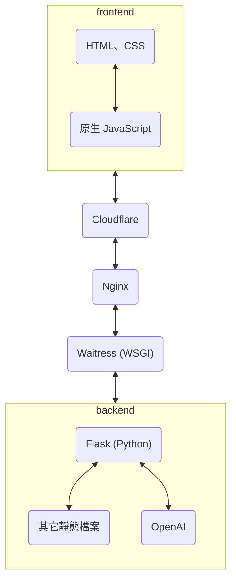
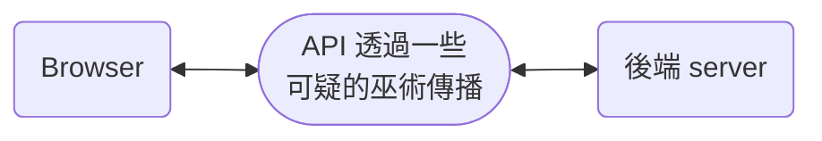

原標題為：半個月零基礎架設前後端分離網站  
這是關於一群小白第一次架設前後端分離網頁就算是圓滿成功的故事，這是一個在聖誕節期間，開放給全校同學遊玩的網頁，透過虛擬的網頁遊戲，找到實際上藏在校園內的糖果。   

本文會記錄在架設整個網站過程中，我做為 Flask 後端與 OpenAI API 串接的人所遇到的困難與使用的方法、技術。  
而在上篇： [《元得要命小鎮的聖誕危機》之誕生日誌（上）](/posts/christmas_project_story/) 中，寫到了我們的專案從發想到上線之間遇到的問題與故事。  

{:w="231" h="500"}
_努力幫我們宣傳的社交女王糖糖_

## 網站架構

雖然[上篇](/posts/christmas_project_story/#3-伺服器選用--網頁架構)大致提到了網站架構，在這邊還是重新細說一遍。  

因為是小小網站，使用了輕量的 Flask 做為後端 server，使用 Python 開發對我們來說比較簡單易上手。  
而前端原本選用 Vue.js 做為框架，後來發現真的沒有時間去學習新框架了，就直接使用原生 JS。  
（不過我有點懷疑這樣是否真的有比較快？如果選用 JQuery 的話會不會再容易一點呢？）  
有點略為可惜的是，這次的 project 的大小與時間沒辦法讓我們碰碰 DB 的部分，不然就會是一個更完整的練習了。  



### 前後端分離究竟是怎麼做到的？

對之前的我來說，「前後端分離」這個詞就像是咒語一樣。  
如同下圖，經過一串不知道什麼巫術讓前後端可以分開來。  

在這之前我的網站開發經驗，就停留在我這個 blog 或是什麼[密室逃脫網頁遊戲](/posts/Inky_escape_game/)，兩者都是靜態的網頁，最多最多也只有串接過一些小小 API 的經驗，從來沒有碰過前端之外的東西。  
這一次，就像上面提到的架構圖，我們使用了 Nginx, Waitress 來讓前端可以順利連到後端的伺服器。  



接下來就讓我從後端往前端介紹使用到的工具。  

#### Flask 是什麼？

Flask 是一個輕量的後端框架，使用 Python 撰寫。  
優點是真的很輕量，幾乎可以用原生 Python 來理解他，同時也內建了測試用的 Dev server 和支援使用 RESTful API，非常符合我們想要快速簡單方便開發小專案的需求。

#### WSGI 是什麼？

WSGI 是 Web Server Gateway Interface 的縮寫，是一種協議、規範 (protocol)，定義了 web server 和 python web application 之間是如何溝通的。  
使用 WSGI 的話，就能讓他幫忙處理負載平衡、反向代理、靜態檔案處理等等問題，我們做為 web 開發者就只要專心處理程式邏輯的部分就好。  

而原本想使用常見的 uWSGI，結果因為 server （實驗室電腦）的作業系統是 Windows，所以無法直接使用，改用了 Waitress。  
Waitress 是純 Python 編寫的 WSGI server，不需要其他 dependencies ，只要 python standard library 就好，所以可以快速安裝使用。  

#### Nginx 是什麼？

他是一個開源的 web server，常見的競爭對手是 Apache ，不過近年大家比較傾向於使用 Nginx。  
Nginx 常用於反向代理、負載平衡等用途上，最大的特點就是效能比起 Apache 還要好，而且比起 Apache 還要容易設置。  
（雖然我本人沒有架設過 Apache，但身邊有用過的人都說痛苦。）  

我們主要使用的是 Nginx 處理靜態檔案與 I/O 的部分，因為我們的網站實在是非常多圖檔、文字檔要給 client ，所以能夠幫我們處理用戶丟來的 GPT request 和要給他們的檔案。  
啊反向代理的優勢還有隱藏伺服器的實際 IP 位置，但因為我們把他和 app application 放在同一台機器上，所以 Nginx 的 IP == 實際 server 的 IP。  
不過不用擔心，我們有 Cloudflare 來幫我們把關安全性的部分～

#### Cloudflare 是什麼？

這東西是我們到了最後才發現需要一個處理 DNS 的角色，不然總不能請大家輸入 ip 位址來存取網站吧。  
於是找到了 Cloudflare，他最大的特點就是不用錢！（你的窮學生模組已上線）  

cloudflare 也是反向代理伺服器，他提供了全球的 CDN （我們用不到）、防 DDOS 等攻擊、 DNS 服務。  
至於 Domain name 我們是用 [Github 學生方案送的免費一年域名功能](https://owen31302.gitbook.io/github-education/apply-free-name-space-heroku)

{:w="600" h="600"}
_反向代理的運作模式（[圖源](https://www.cloudflare.com/zh-tw/learning/cdn/glossary/reverse-proxy/)）_

## 後端的運作

[上篇](/posts/christmas_project_story/#3-網頁功能與故事)大致上提到了網站需要的功能，在這個專案中我們分成了 2 個 API：  

1. `/csv` ：回傳劇情的下一句話
2. `/standard/gpt` ：接收使用者傳送給 GPT 的訊息，並回傳 GPT 的回覆。 

現在看來只能說， API 名字取得真糟哈哈。  
看在我們都是小白而且用半個月趕工出來的份上，就原諒一次啦 ><  
使用了 RESTful API，這樣比較好傳複雜一點的值給 JS 做處理，內建的 Flask 參數傳遞方法我們使用上不夠順手  
（其實是忘記為什麼用不上去了，再不寫會議紀錄啊！！）  

稍微講解每一個 API 的參數傳遞等運作方式吧～

### 1/ 取得劇情的下一句

我們的劇情使用 csv 做儲存，這樣人類們比較好編輯，程式也方便讀取。  
每一天的劇情存在一個 csv 中，根據 `session` 儲存的是哪一天來選擇要使用哪一份 csv 檔。  
這一個 API 不用接收值，下表是 API 回覆的值的格式，全部都是 string 型態。  

| Name    | Description            | Example                                                  |
|---------|------------------------|----------------------------------------------------------|
| name    | 角色名稱               | 符文法師                                                 |
| picture | 角色的圖片或背景圖     | rune_mage.jpg                                            |
| content | 說話的內容或顯示的文字 | 我好不容易畫的法陣都被杜芬舒斯炸掉了，我原本想召喚老婆的！ |
| input   | 玩家輸入框顯示的文字   | NULL                                                     |

傳到前端後，讓 JS 把他顯示在相應的 HTML 元素上，就變成玩家能看到的樣子。  
使用 `session` 儲存現在使用者跑到了哪一句。  

#### Flask 的 Session 是什麼？

大家常聽到的應該是叫做 cookie 的東西，這個就算是 client side session 的簡化版，儲存在 client 端，也就是使用者的瀏覽器上，讓網站可以暫時儲存一些使用者的資訊，提升使用者的體驗。  
Client side session 比起 cookie 更安全且更複雜一點。  
而 Flask 中的 Session 就是 server side session，被儲存在 server 端，使用者沒辦法看到，而且也經過了加密。  

其實這裡應該要使用 client side session 或是 cookie 儲存跑到了第幾句比較好一點，不過這裡是沿用我在 `/standard/gpt` 那支 API 裡的寫法，就不讓前端處理太多程式邏輯。  
（但、但是最後前端還是使用了 cookie 去儲存一些角色名字、說話語句等訊息......）

{:w="231" h="500"}
_實際呈現給使用者的畫面示例_

### 2/ 取得 GPT 的回覆

這是我負責的部分，包含了調整每個角色要餵給 GPT 的 prompt ，還有撰寫他的 API。  
同時我也算是後端的隊長，先去試試 Flask 怎麼寫，再提供方法給 `/csv` 那邊參考，開會或臨時要改 code 的話也會先由我處理。  

這支 API 接收的 request 格式如下：

| Name | Description          | Example    |
|------|----------------------|------------|
| data | 使用者輸入的文字     | 海豚在哪   |
| name | 使用者對話的角色名字 | 糖糖愛慕者 |

根據收到的資訊，串接 OpenAI 的 API，取得回覆後依據下方的格式回傳給前端。  
並且會使用 `session` 來儲存這個使用者和 GPT 近 10 筆的對話紀錄，好讓對話可以連貫。  
（原本差點使用「把對話記錄傳給前端，前端用變數存起來後，下一次呼叫 API 時再傳給後端」的笨方法......）  
每一個 NPC 對應的 prompt 都被存在另一份 csv 檔中。
關於 OpenAI 的 API 的串接可以參考下面的 [OpenAI GPT 串接](#1-openai-api-串接)。  

| Name       | Description                    | Example               |
|------------|--------------------------------|-----------------------|
| content    | GPT 回應的文字                 | 海豚雕像在甜點區旁邊。 |
| is_correct | 使用者是否回答出糖果盒上的答案 | False                 |
| candy_pic  | 找到的東西的圖片               | queen_face.png        |

其中，玩家找到了校園內糖果盒的正確位置，就可以得知糖果盒上貼的答案。  
將其輸入後，就判斷為找到了糖果，將 `candy_pic` 的圖片顯示在前端的提示框，並繼續接下來的劇情。  

{:w="231" h="500"}
_找到糖果盒後輸入正確答案，就能看到提示框_

## NPC 與 GPT

最花時間的不是寫 code，而是反覆調整給 GPT 的 prompt......  

### 1/ OpenAI API 串接

在講 prompt 之前，先來簡單說說怎麼串接到 OpenAI 上吧！  

#### 1.1/ 取得 API key

要能夠連上 API，最關鍵的就是要透過你的 OpenAI 帳號去取得 API key。  

1. 進入 [OpenAI 的網站](https://openai.com/) 並選擇 "**API**" 登入。  
2. 在左側選單中選擇 "**API keys**" 。
3. 點擊 "**+ Create new secret key**" 並填入你日後能辨別的名字（也可以不填）。
4. 複製他給你的 key，要保存好喔，日後是沒辦法重新查看這個 key 的。  

OpenAI 網站這裡就大致搞定！

#### 1.2/ 用 Python 連上 OpenAI

這裡就大致提一下，更詳細的教學可以參考[官方文件](https://platform.openai.com/docs/api-reference/chat/create)。  

1. 安裝 openai
    ```bash
    pip install openai
    ```
2. import openai 並填入剛剛取得的 api key
    ```py
    from openai import OpenAI
    client = OpenAI(api_key="你的 API key")
    ```
3. 把要給 GPT 的對話紀錄傳送給 OpenAI 並取得回覆後印出來 
    ```py
    completion = client.chat.completions.create(
      model="gpt-3.5-turbo",
      messages=[
        {"role": "system", "content": "You are a helpful assistant."},
        {"role": "user", "content": "Hello!"},
        max_tokens=125,
        temperature=0.6
      ]
    )

    print(completion.choices[0].message)
    ```

在這裡，我調整了 `max_token` 和 `temperature` 兩個參數，這兩個對於我們的專案影響較為顯著。  

{:w="600" h="600"}
_有時候可以在 log 裡面找到好玩的對話紀錄（點擊可看大圖）([原圖點我](https://github.com/titaliu1224/titaliu1224.github.io/blob/main/assets/img/posts/christmas_project/conversation.png))_

### 2/ 調整 AI 參數

參數雖然比起 prompt，其它參數對於 AI 的表現沒有那麼大的影響，但是如果調不好，也會讓 AI 不像是我們希望他表現的樣子。  
要怎麼做調整才能讓 AI 照著我們想像中的行動呢？  

其實再怎麼調，生成式 AI ，應該是說任何基於機器學習的 AI，做出的結果都很難被人類做預測。  
所以要他們能夠一字一句的照著人們的意思行動，是很難透過調整一兩個參數、幾句 prompt 達成的。  
在看大家和 AI 對答的 log 時，我們也常有「唉～沒辦法～ AI 不會那麼聽話」的想法出現。  

#### 2.1/ Temperature 是什麼？

它用來控制 AI 的自由發揮程度。  
Temperature 越高， AI 的回答就會越隨機、越不受控制，但同時也會更像是小鎮居民在快樂對話的樣子。  
如果把 temperature 調太低， NPC 就會變得有點不知變通，像是死板的機器人。  

OpenAI 提供的參數可以在 0 ~ 2 之間進行調整，我們的 NPC 都落在 0.4 ~ 0.8 之間。  
主要的調整依據是：

1. 是否能根據問題回答出正確的糖果位置提示
2. 回答的方式是否符合角色個性

#### 2.2/ Token 是什麼？

在 OpenAI 的 API 中，餵給 AI 文字、要 AI 產生文字都必須花費 token。  
Token 的數量和字串的長短呈正相關，以中文字來說大約是 token = 字數 * 1.5 這樣。  
可以透過官方的 [token 計算機](https://platform.openai.com/tokenizer)來估算一句話是多少 token。  

在這個專案中，因為手機能呈現的字數有限，我使用 `max_token` 直接限制 GPT 能回覆的字數，順便減少 token 的消耗。  
（窮學生模組大力運作中）  

#### 2.3/ 歷史訊息是什麼？

在參數 `message` 中要傳送訊息的歷史記錄，我們可以指定 `role` 是誰，共有 4 個角色可以選：

1. system: 系統訊息，應該類似於 ChatGPT 的「自訂指令」功能。  
2. user: 使用者傳送的訊息，在這裡就是指玩家。
3. assistant: 模型生成的訊息，這裡是指 NPC。
4. tool: 提供模型額外的訊息，這個專案中沒有使用到。  

我在這裡主要使用 `system` 來告訴模型該扮演什麼角色，還有他應該要知道的糖果位置資訊。  

{:w="600" h="600"}
_持續和 AI 對話以找到完美參數_

### 3/ 如何下 Prompt？

接下來就讓富帥．高作為示範。  
我會使用三個 `{"role": "system", ""content"":}` 來包不同的內容。  
如果全部包在同一個 `{}` 中的話，可能會因為字數太多，導致 AI 被模糊焦點，無法回答出正確的答案。  

#### 3.1/ NPC 的基本資訊

第一個 `{}` 會是他需要知道的基本資訊

1. 先讓 AI 知道他是誰
    > 你是一個繁體中文文字角色扮演遊戲的NPC，你是一個憨厚的矮人礦工，名字是「富帥．高」。
2. 告訴他現在的所在位置，還有其它劇情中提到的資訊（雖然已經透過劇情文字告訴了玩家，但避免玩家再詢問一次）
    > 你住在礦山III上（礦山3）
3. 再來就是一些他該知道的資訊，如杜芬舒斯在破壞小鎮、糖糖的派對、他認識的人等。

#### 3.2/ 糖果位置的提示

第二個 `{}` 是關於糖果位置的提示，是整個遊戲中最關鍵的部分。  
這裡可以善用一些分隔符號，例如（）中的文字可以寫一些用來給模型的話。  
像是下面所提的「一字不差」就很常出現在大家的 prompt 中，對於要解謎的環節，有時候差了 1 、 2 個字，雖然中文上的意思相同，卻無法準確的給予玩家提示。  
相同功用的還有 *（請精確的形容糖糖為「風華絕代」）* 等。  
尤其是 GPT 常常會加一些廢話或語助詞，導致語句太長被截斷，所以我經常會告訴他要控制字數（雖然不是 100% 有效就是了）。  

> 傳說中礦山裡有一個神奇的石頭，在小鎮生長了數百年，雖然你不知道在哪裡，但祖先有留下一些傳說（當問到石頭位置時，請把這段傳說一字不差的講出來，但請你控制字數）：「那種石頭都長在地底下，一定會跟著紅椅石一起出現，旁邊有新鮮好喝的山泉水，但要小心吼，它有時候是沸騰的，傳說有一條沉睡中的巨大灰龍一直守護著石頭。」

#### 3.3/ 關於說話的規定

這裡就是讓 NPC 知道他正在跟誰說話、說話的長短。  
雖然已經使用 `max-token` 限制了類似於最大字數的規定，但他做的是直接截斷，不論句子的完整性。  
早期的 ChatGPT 很常見到他講到一半就斷掉，要人說「繼續」才會完成句子， `max-token` 就是這樣去做限制的。  
但是我希望每一次使用者都能夠儘量看到完整的句子，不被強制截斷，所以就限制 AI 只能說 30 字。  
（但他要不要遵守又是另一回事了......）  

> 你正在跟一個熱心的冒險者對話。你的回答內容簡短，不應超過三十字。  


實際體驗過後，我發現其實 GPT-3.5 還沒有想像中那麼神奇，無法百分之百抓到人想表達什麼，或許 GPT-4 會好很多？  
（不過我們太窮ㄌ沒有要試）  

這些都調整完後，就是透過不斷的嘗試，來調整 prompt 和 temperature。  

{:w="231" h="500"}
_如果說話的語句太長，就會被強制截斷_

## 結語

這次的專案開發雖然很趕，卻是一個相對完整的經驗。  
我終於接觸到夢寐以求的後端程式，也把「可以自由和 NPC 對話」的遊戲場景夢想做一個實踐。  
雖然 GPT 還是沒辦法真的像人類那樣聽話，但是在這個小遊戲中也算夠用了。  
歡迎對遊戲、網頁開發、GenAI 有興趣的人嘗試類似的 project～  
有任何問題或感想都可以在底下留言讓我知道，或是按個表情對我來說也是很大的鼓勵！

可以再改進的地方應該就是：
1. 要寫更完整的文件（不然我現在寫起文來好痛苦）
2. 架設測試用的 server 或更好的擋住非網站開放時間進來的人
3. code style 可以再討論得更一致
4. 更加善用 cookie 和 session
5. 開會的時候不要急，心平氣和的好好開會、不要岔題

## 參考資料

- [什麼是 WSGI & ASGI ? (Python 面試題)](https://medium.com/@eric248655665/%E4%BB%80%E9%BA%BC%E6%98%AF-wsgi-%E7%82%BA%E4%BB%80%E9%BA%BC%E8%A6%81%E7%94%A8-wsgi-f0d5f3001652)
- [\[基礎觀念系列\] Web Server & Nginx — (2)](https://medium.com/starbugs/web-server-nginx-2-bc41c6268646)
- [那麼，Cloudflare 是什麼呢？](https://www.cloudflare.com/zh-tw/learning/what-is-cloudflare/)
