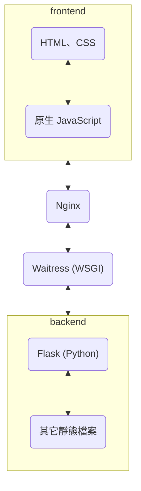

原標題為：半個月零基礎架設前後端分離網站  
這是關於一群小白第一次架設前後端分離網頁就算是圓滿成功的故事，關於故事內容可以先看這篇 [Dcard 宣傳文](https://www.dcard.tw/f/yzu/p/254172751)。  

本文會記錄在架設整個網站過程中，我做為 Flask 後端與 OpenAI API 串接的人所遇到的困難與使用的方法、技術。  
而在上篇： [《元得要命小鎮的聖誕危機》之誕生日誌（上）](/posts/christmas_project_story/) 中，寫到了我們的專案從發想到上線之間遇到的問題與故事。  

## 網站架構

雖然 [上篇](/posts/christmas_project_story/#3-伺服器選用--網頁架構) 大致提到了網站架構，在這邊還是重新細說一遍。  
再上一次架構圖：

我們因為是小小網站，使用了 Flask 做為後端 server，使用 Python 開發對我們來說比較簡單易上手。  
而前端原本選用 Vue.js 做為框架，後來發現我們真的沒有時間去學習新框架了，就直接使用原生 JS。  
（不過我有點懷疑這樣是否真的有比較快？如果選用 JQuery 的話會不會再容易一點呢？）

### 1/ 前後端分離究竟是怎麼做到的？

