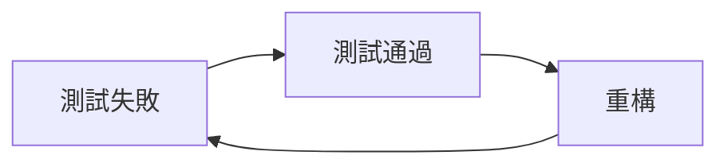

Coding Dojo，每個程式設計師都會碰過的練習題，旨在透過非常簡單的需求，讓工程師熟悉快捷鍵的操作和程式設計的 mindset，而 Kata 就是其中一個分類。  
我一直想要嘗試很久了，而這次選擇 Bowling Kata 做為我的第一個 Kata（因為它是 B 開頭，被排在前面哈哈）。  
本文來聊聊我實作過程的心得，包含我是怎麼 implement TDD (Test Driven Design) 和其中遇到的設計難題。  
（就是會包含內容劇透的意思）  

至於實際上 code 的完整性和設計想法也可以和我討論！  
小菜雞的第一次總是沒辦法考慮周全。

> 有興趣的話可以參考我的 source code：[GitHub](https://github.com/titaliu1224/Coding-Dojo/tree/main/bowling-kata)

## 題目

前面說了這麼多，所謂的「簡單需求」究竟有多簡單？  
這就把題目大意附上：
寫一個保齡球計分程式，包含兩個 Method：
- `void roll(int)`: 每次玩家丟保齡球時會呼叫，參數為擊倒的瓶子數量
- `int score()`: Return 當前遊戲的分數

保齡球有這些規則：
1. 遊戲共 10 局，每局最多兩次投球。
2. 全倒為 Strike，補中為 Spare。
3. Spare 獎勵下一球的瓶數；Strike 獎勵下兩球的瓶數。
4. 第 10 局若 Strike 或 Spare，可多投補完，但最多三球。

沒錯，就是保齡球館上方的那個小螢幕的簡化版，不用紀錄每一局的分數和玩家擊倒的瓶數。  

## 為何要做 Kata？是誰適合做？

我個人想練習 Kata 的原因就是~~我很菜~~我對於 TDD 和重構的方式仍不夠熟悉，在工作上無法順利發揮作用。  
至於是誰適合做，我非常推薦剛開始想熟悉 IDE 或是 VIM 操作的朋友從這裡開始，可以練習到很多快捷鍵的使用。  
也推薦已經對基礎程式語法熟悉，想要開始觸碰「設計」領域的朋友，別看它簡單，不論是多小的需求我們都應該設計出可維護性好的程式碼。  

## 什麼是 TDD？

TDD（Test Driven Design，測試驅動開發）是一種設計模式，特點是先寫測試，再寫 production code。  

### 好處

它的好處有很多：
- 更高的測試覆蓋率：非常直觀，程式是從測試長出來的，所以每一行程式碼都應被測試保護。
- 更乾淨的設計：先寫測試可以迫使你思考如何把程式模組化並降低耦合。
- 更安心重構：有了測試保護，自然可以大膽重構。
- 更好理解需求：在寫測試時就需要清楚定義預期的行為，不會等到程式都寫完後才發現行為不符預期。
- 更完整的測試情境：如果先寫程式，寫測試時常常會變成測試在迎合主程式，導致測試情境不完整。

另外還有一些小優點，例如你需要 context switch 到其他事情上（例如有人找你 code review 或是開會），在你 switch 回來後可以透過測試來找回你原本的進度。  

### 如何進行

TDD 是一個紅燈 -> 綠燈 -> 重構的循環，詳細來說是這樣的：  
1. 根據需求寫一個測試，並解決所有編譯錯誤
2. 執行這個測試，會失敗
3. 以**最小**能通過測試的改動修改 production code
4. 重構 production code，測試不能壞掉

其中，最小改動是一個重點，每一次寫的 code 都應該恰巧可以通過測試，不用做多餘的處理或設計。  



## 寫測試囉

接下來進入正題吧，怎麼生產我需要的測試案例？  

> 接下來會有 bowling kata 劇透，想要嘗試的同學請**儘快離開**不要再往下看了！！  
> 等你寫完再回來，我不會刪文的。
{: .prompt-danger}

整體上，我花了兩個下午來完成整個練習，這時間可以說是非常長，但有完成就是個好的開始。  
使用的語言是 .NET 9，測試框架是 NUnit，於是就產生了這樣子整齊好看的測試檔案：


_令人賞心悅目的測試_

### 如何設計測試案例？

測試案例應包含正反例和所有可能發生的情況，在構思時，我會遵照數量來排序。  
也就是這樣：
1. 0，可能是初始值或是空值，以 bowling kata 為例，就是一開始分數為 0
2. 1，最簡單的案例，就是擊倒 1 個瓶子的情況
3. 複數個，例如丟球多次，分數要能夠累積

### 最小改動

TDD 的規則之一：每個測試所產出的 code 都只剛剛好符合測試的需求。  

#### 範例

現在讓我們撰寫第一個測試：分數要從 0 開始。  
建立 `int Score()` method，先假設它 return -1 好了。  
執行測試，失敗。  
修改 production code：呼叫 `Score()` 時會 `return 0`。  
執行測試，成功。  
需要重構嗎？似乎不用。  

這裡我是讓他直接 return 0，而非建立一個 field `_score = 0`，而後 `return _score`。  
為什麼？因為不需要。  
測試的驗收條件只有「分數從 0 開始」。  

> 為什麼一開始先讓 method return -1 呢？  
> 這是為了讓測試失敗，達成「紅燈」的步驟。  
> 紅燈很重要，測試如果一直都是綠燈，我們無法得知它是否有在正確照著需求運作，還是我們的測試打從一開始就沒有照著預期運作，一直在驗收錯誤的結果？  
{: .prompt-info}

有的人認為編譯錯誤也是一種紅燈的體現，所以可以讓該 method 維持不 return 任何東西，造成回傳型別不匹配的錯誤或是 `NotImplementExcpetion` ，但我並不喜歡這樣。  

不過，100 個人就有 100 種 TDD 的方式，適合自己的方法便是最好的方法。  

### 第二個測試

或許你會和我一樣，看到有 method 直接 return 0 就渾身不對勁，所以來寫第二個測試吧：  
當 `Roll(1)` 後，分數要為 1。  

這時就會發現，單純 return 0 或 return 1 都無法同時滿足這兩個測試，於是 field `_score = 0` 就該出場。  
而 `Roll(int pins)` 就會變成 `_score = 1` 或是 `_score += 1` 或是 `_score += pins`，取決於這一步想要走得多大步（或是你對於「最小改動」的定義）。  

現在我們完成了「0」和「1」的測試案例，接下來朝「複數」邁進吧：  
第三個測試，當 `Roll(2)` 後，分數為 2。  
第四個測試，當 `Roll(1)` 再 `Roll(2)` 後，分數為 3。

### Re-Architecture

前面幾個 Roll、Spare 的規則非常簡單，可以讓人感受到 TDD 開發的愉悅感，就像是攻克著難度剛好的關卡。  
然而 bowling kata 在中期必然會遇到瓶頸，你會開始發現現存的架構完全無法支援 strike 和 spare 的交叉判斷，所以重新設計架構是預期的。  

接下來就是一段振奮人心的架構設計過程，我好像有點找回當初在寫 leetcode 的感覺。  
這可能是第一次我自己從頭設計一套完整的架構，想想就興奮。  

#### 我的設計

這邊簡單分享我的設計，不是要讓大家抄答案的意思。  
必須承認，撰文的當下距寫完已有三週之久，現在回頭看真是差強人意。  
就不詳細解釋我的設計理念，總之最一開始，只有一個 `int _total` 在支撐著所有的分數計算，另外有一個 `bool isSpare` 負責處理當前丟的球是否要兩倍分數。  

然而當 spare 後接著馬上 strike；或是 strike 後再 strike 2 次，都是非常困難處理的情況，必須保留前幾局的的 spare/strike 狀態。  

於是我創建了一個新的物件 `Roll`，而整個 Game 會有一個 `List<Roll> _rolls`。  

```cs
internal class Roll
{
    public int Score { get; init; }
    public bool IsSpare { get; init; }
    public bool IsStrike { get; init; }
}
```

之後的每次 `Roll(int pins)`，會去計算這是第幾局、判斷它是否合法（第十局最多只能 3 rolls）、是否 spare 或 strike。  


```cs
public void Roll(int pins)
{
    _rollCountOfThisFrame = ++_rollCountOfThisFrame % 2;
    ValidateRoll();

    var roll = new Roll
    {
        Score = pins,
        IsSpare = CheckSpare(pins),
        IsStrike = CheckStrike(pins)
    };
    _rolls.Add(roll);

    CalculateFrameCount();
    _scoreOfLastRoll = pins;
}
```

如此便能處理所有需要的一切。  

## 必要性

隨著時代演進，這種幾十年前流傳下來的練習方式真的還有效嗎？  

### TDD 的必要性

有時在撰寫一些瑣碎的測試時，不免會冒出幾個想法：  
先寫程式，在截止日期前上線比較快。  
測試之後再補也可以。  
我不需要那麼多的測試，寫幾個代表性的就好。  

TDD 的使用時機確實會根據情況不同而產生差異，但是「測試覆蓋率」卻是一個無法忽視的重要指標。  
當測試先行，所有程式都來自於測試，那測試覆蓋率自然就會接近 100%。  

當 AI 與 Vibe Coding 逐漸盛行，雖然測試的重要度不減，但「何時寫測試」也就成了另一個議題。  
有時讓 AI 先產 production code，我們 end-to-end 驗證功能沒有問題後，再請 AI 產測試也是一個很好的方法。  

### Kata 的必要性

針對這個問題，我的答案絕對是肯定的，尤其當你是一個尚未熟悉 IDE 快捷鍵的新人/Junior。  
即便 AI 早已普及，基礎的 refactor 技能仍舊不可或缺，有時自己改還是比起 AI 快速且可靠。  

透過這次的練習，我必須主動思考怎麼樣以最有效率的方式長出 一個新的 class、method 並放在正確的資料夾或檔案中。  
或許也可以藉機微調自己的快捷鍵設定，讓環境變得更加順手。  

## 結語

整體來說，寫 Kata 的過程中我感到很滿足。  
那恰到好處的挑戰性與成就感，加上真的有學到東西，使我感覺像是一個成熟的工程師。  
之後也會繼續嘗試不同的 Kata 的。  

簡單的小練習，推薦給也需要練習的人。  